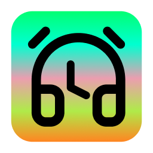

# Headscratcher

I always wanted an application reminds me that the playlist I am listening is ended and I am still wearing headphones for nothing. So, *Headscratcher* is a macOS menu bar application that helps you when you forget to play some music in your headphones because of hyperfocus or something else.

## Features

- Lives quietly in your menu bar
- Automatically detects connected Bluetooth audio devices
- Monitors audio playback status
- Sends notifications when audio devices are connected but idle
- Customizable notification timing (10 seconds to 10 minutes)
- Supports a wide range of audio devices

## Installation

1. Download the latest release
2. Move the app to your Applications folder
3. Apple may warn you "Apple could not verify “Headscratcher” is free of malware that may harm your Mac or compromise your privacy." Unfortunately, I am not enrolled in the Apple Developer Program, so I cannot sign the app. You can bypass this warning by going `System Settings` > `Privacy & Security` > `Security` > `Open Anyway`
4. Launch the app
5. Grant Bluetooth and Notification permissions when prompted

## Usage

1. Click the headphones icon in the menu bar to see the current status
2. You can:
   - Adjust notification timing preferences

The app will automatically:
- Monitor for audio playback
- Send notifications if no audio is playing for your selected duration

### Some Caveats

- The app may not work with some audio devices, if you have specific model in your mind; you can contribute to `audioKeywords` in `AudioMonitor.swift` file.
- This application is using `kAudioDevicePropertyDeviceIsRunningSomewhere` property to detect audio playback status. This property is not available for all audio devices, so the app may not work with some audio devices. Also, there is some limitations with `kAudioDevicePropertyDeviceIsRunningSomewhere`. Unfortunately, macOS does not offer a simple, universal API for monitoring system-wide audio output. When you navigate to a site like youtube.com—even if you don’t consciously press play—the browser (or its underlying audio framework) may open an audio session or reserve an audio channel. As a result, the system-level property (via `kAudioDevicePropertyIsRunningSomewhere`) reports that the device is “active.”

As a workaround, I set `minimumPlayingDuration` so that the app will not send a notification if the audio is playing for less than 15 seconds. This is a trade-off between false positives and false negatives. If you have any suggestions, please let me know.

## Requirements

- macOS 11.0 or later
- Bluetooth capability
- Notification permissions

## Privacy

Headscratcher requires:
- Bluetooth access to detect audio devices
- Notification permissions to send alerts
- No internet connection required
- No data collection

## Building from Source

1. Clone the repository
2. Open in Xcode 13 or later
3. Build for macOS target
4. Required capabilities:
   - Bluetooth
   - Notifications

## License

MIT
